<p align="center">
  
</p>

<h1 align="center">Turn Detection Model</h1>
<p align="center"><strong>Whisper Tiny + dual-scale attention for low-latency voice AI</strong></p>
<p align="center">Audio-only end-of-turn classification for Hindi and English — fillers, internal pauses, and false interruptions included. No ASR at inference time.</p>

<p align="center">
  <a href="https://github.com/keshav-077"></a>
  <a href="https://www.linkedin.com/in/keshavardhan-m-9b8a22314/"></a>
</p>

<p align="center">
  <a href="https://huggingface.co/spaces/keshav-077/hinglish-turn-detector-inference"></a>
  <a href="https://huggingface.co/keshav-077/hinglish-turn-detector-whisper-tiny-dual-scale"></a>
  
  
</p>

<p align="center">
  
</p>

<p align="center">
  
</p>

<p align="center">
  <a href="reports/FINAL_REPORT.md">Technical report</a> ·
  <a href="reports/METHODOLOGY.md">Methodology</a> ·
  <a href="docs/RUNPOD.md">RunPod guide</a> ·
  <a href="docs/HUGGINGFACE_SPACE.md">Hugging Face Space guide</a>
</p>

---

## Overview

The selected **E6** model is an **8.30M-parameter** network: Whisper Tiny audio encoder, dual-scale classification head, and one round of hard-negative mining. The deployed artifact is a **10.16 MiB dynamic INT8 ONNX** model.

Results below are from **21,995** held-out examples. Temperature, probability threshold, silence delay, and fallback timeout were selected on validation and frozen before test evaluation.

| Metric | E6 dynamic INT8 |
|---|---:|
| F1 | **0.7399** |
| Balanced accuracy | **0.8248** |
| AUROC | **0.9361** |
| Average precision | **0.7983** |
| False-cutoff rate | **4.72%** |
| False-hold rate | 30.33% |
| Expected calibration error | 0.1043 |
| Mean causal endpoint latency | 512.3 ms |
| End-to-end CPU latency, p50 / p95 / p99 | 47.36 / 82.36 / 87.90 ms |
| Dynamic INT8 size | 10.16 MiB |

On the same test rows and under the same validation-selected **5% false-cutoff budget**, Smart Turn v3.2 scored **0.4364** F1. This model scored **0.7399**, a paired improvement of **+0.3035** F1. The 95% parent-turn bootstrap interval was **[+0.2884, +0.3182]**.

<p align="center">
  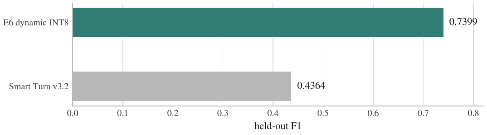
</p>

The baseline comparison uses the same held-out rows and a policy selected under the same validation interruption budget. It is not a comparison of independently tuned test-set thresholds.

Hindi false-cutoff rate is **11.44%**, compared with **3.62%** for English. Filler-heavy and noisy speech are harder; those errors are reported below rather than hidden behind the aggregate score.

---

## What the model decides

A voice activity detector finds silence. It cannot tell a finished request from a thinking pause:

```text
"mujhe ek cab book karni hai"          likely COMPLETE
"mujhe ek cab book karni hai, umm..."  likely HOLD
"number is nine eight seven..."        likely HOLD
```

After a lightweight VAD observes a candidate pause, this model scores the **last eight seconds** of audio and returns a calibrated probability of `COMPLETE`. If the score is below the threshold, the application keeps listening until speech resumes or the fallback timeout is reached.

| Setting | Value |
|---|---:|
| Calibrated threshold | 0.38 |
| Temperature | 2.5522 |
| Minimum candidate silence | 300 ms |
| Fallback timeout | 1,000 ms |
| Test turn-level false-cutoff rate | 4.97% |
| Mean / p95 endpoint latency | 512.3 / 1,000 ms |

<p align="center">
  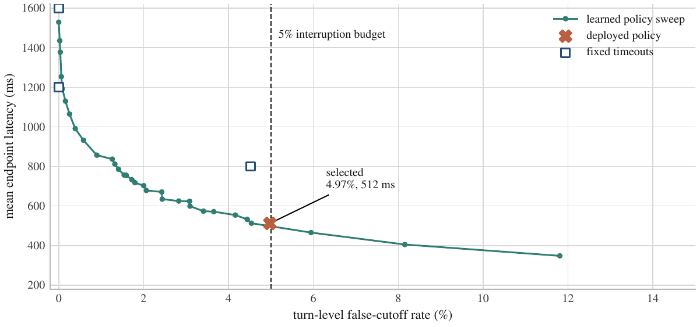
</p>

The selected operating point sits just inside the **5%** turn-level false-cutoff budget. The timeout is part of the contract: a low false-cutoff rate is not useful if the system achieves it by waiting several seconds on every turn.

---

## Architecture

<p align="center">
  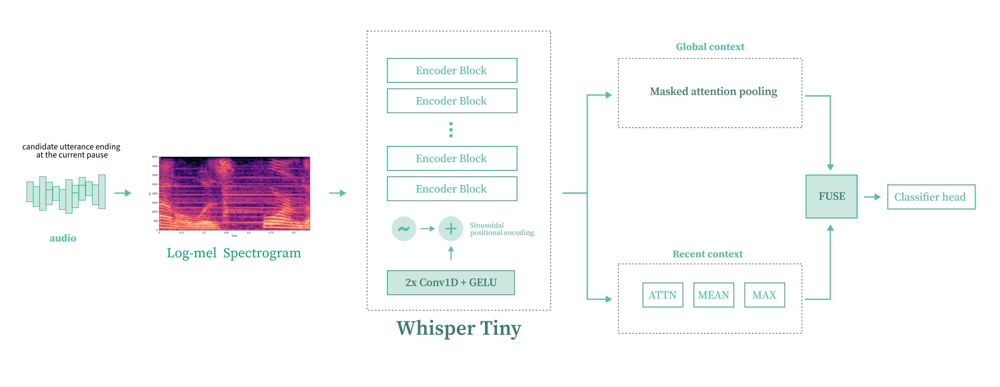
</p>

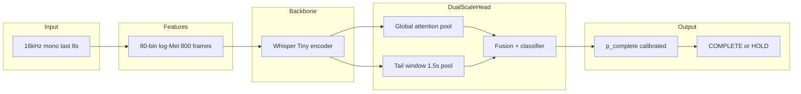

The global branch carries context from the full turn. The tail branch concentrates on recent cadence, hesitation, and fillers. A separate two-output filler head predicts mid-turn and end-turn fillers during training; it is omitted from the exported inference graph.

| Component | Detail |
|---|---|
| Backbone | `openai/whisper-tiny` encoder |
| Total parameters | 8,299,397 |
| Parameters outside the encoder | 513,413 |
| Input | 16 kHz mono, last 8 s |
| Features | 80 Mel bins, 800 frames |
| Recent window | final 1.5 s |
| Runtime output | calibrated probability and `COMPLETE` / `HOLD` decision |

---

## Data preparation and training

The pipeline accepts only rows marked `hin` or `eng`. The main label is `endpoint_bool`; `midfiller` and `endfiller` supervise the auxiliary head. Source metadata does not contain a human-verified Hinglish or code-switch label — Hindi and filler slices are useful for the intended use case, but this is not claimed as a Hinglish benchmark.

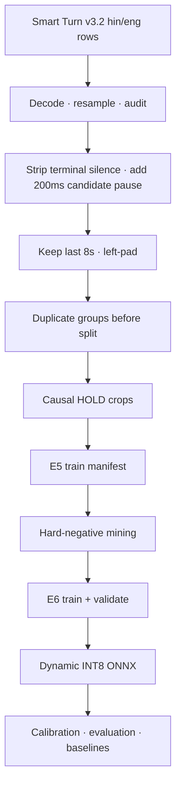

Preparation steps:

1. Decode, resample, and normalize to mono 16 kHz.
2. Reject empty, non-finite, clipped, or invalid-duration audio.
3. Remove arbitrary terminal silence and add a fixed candidate pause.
4. Keep the most recent eight seconds and left-pad shorter clips.
5. Group exact and near duplicates before splitting.
6. Create causal `HOLD` crops only when later speech proves that the speaker continued.
7. Store prepared audio as FLAC with versioned JSONL manifests.

The E5 manifest contained **180,589** training examples from **73,679** parent utterances. Hard-negative mining added **10,933** difficult `HOLD` examples for E6 (**191,522** training examples). Validation contained **9,493** examples.

| Sampling mass | Value |
|---|---:|
| Hindi / English | 50% / 50% |
| COMPLETE / HOLD | 35% / 65% |
| Filler-bearing examples | 53.4% |
| Causal-pause examples | 44.9% |
| Mined hard negatives | 30% |

Training used weighted binary cross entropy for the turn label (`HOLD` errors weighted 2×), plus a 0.15-weight auxiliary filler loss. The encoder was frozen for the first **500** optimizer steps, then fine-tuned at a lower learning rate than the head.

| Training setting | Value |
|---|---:|
| Physical / effective batch | 32 / 256 |
| Maximum epochs | 4 |
| Encoder / head learning rate | 1e-5 / 1e-4 |
| Warmup | 5% |
| Precision | BF16 |
| Checkpoint selection | validation endpoint delay subject to ≤5% false cutoffs |
| Tracking | Weights & Biases |

On CUDA 12.4, E6 completed in **1,048 s** on one NVIDIA L40S. Hard-negative mining took **1,198 s**. See the [technical report](reports/FINAL_REPORT.md) for run chronology and the CPU-fallback lesson that led to the bootstrap CUDA check.

<p align="center">
  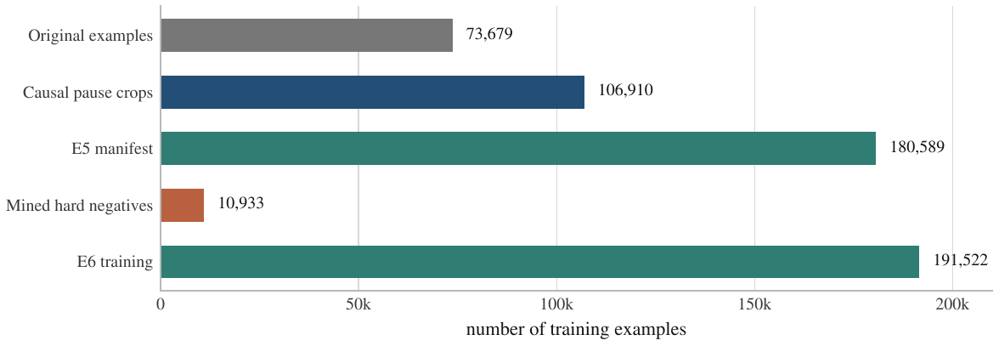
</p>

<p align="center">
  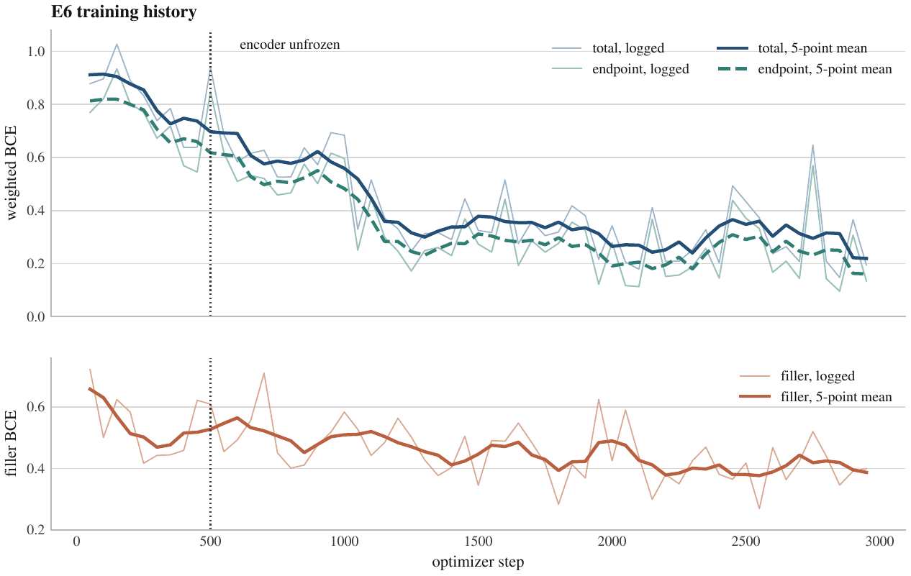
</p>

<p align="center">
  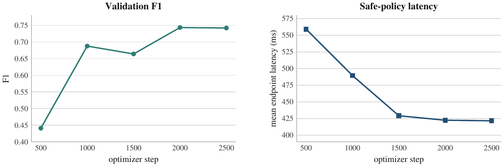
</p>

---

## Evaluation

### Main slices

<p align="center">
  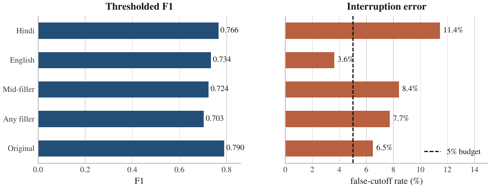
</p>

| Slice | Count | F1 | False-cutoff rate |
|---|---:|---:|---:|
| Hindi | 3,124 | 0.7656 | 11.44% |
| English | 18,871 | 0.7340 | 3.62% |
| Mid-filler | 5,099 | 0.7239 | 8.40% |
| Any filler | 6,235 | 0.7034 | 7.73% |
| Original endpoint examples | 8,955 | 0.7905 | 6.48% |

The Hindi F1 is higher than the English F1, but Hindi false cutoffs are much worse. For a turn detector, that distinction matters more than the headline F1.

Some important slices contain only one class. F1 is undefined there; the generated report prints `Not available` instead of inventing a value.

### Robustness

<p align="center">
  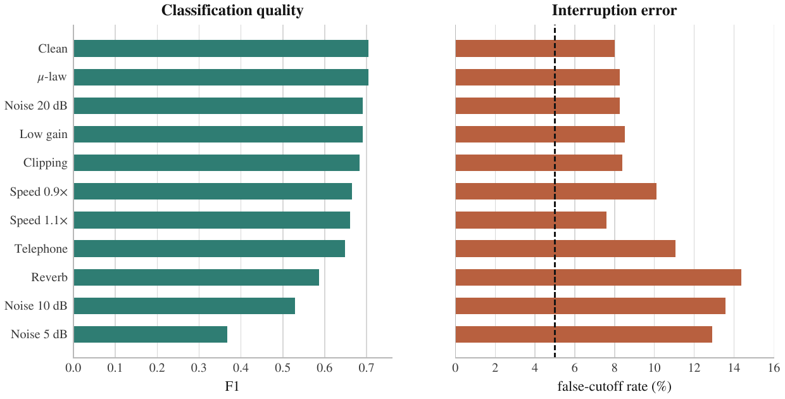
</p>

| Condition | F1 | False-cutoff rate |
|---|---:|---:|
| Clean subset | 0.7044 | 7.99% |
| Clipping | 0.6835 | 8.39% |
| Low gain | 0.6904 | 8.52% |
| μ-law | 0.7042 | 8.26% |
| Noise, 20 dB | 0.6905 | 8.26% |
| Noise, 10 dB | 0.5283 | 13.58% |
| Noise, 5 dB | 0.3679 | 12.92% |
| Reverb | 0.5861 | 14.38% |
| Speed 0.9x | 0.6653 | 10.12% |
| Speed 1.1x | 0.6608 | 7.59% |
| Telephone | 0.6477 | 11.05% |

Moderate noise, clipping, gain changes, and μ-law remain usable. Heavy noise and reverb are clear failure modes.

### Quantization

<p align="center">
  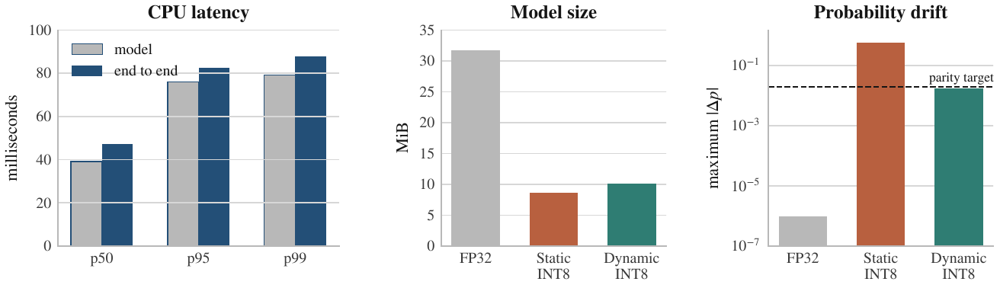
</p>

| Export | Size | Max probability delta | Mean delta | Decision |
|---|---:|---:|---:|---|
| FP32 ONNX | 31.73 MiB | 0.000001 vs PyTorch | — | Reference |
| Static INT8 QDQ | 8.68 MiB | 0.574263 | — | Rejected |
| Dynamic INT8 weight-only | 10.16 MiB | 0.017759 | 0.009105 | Selected |

### CPU latency

Latency was measured with ONNX Runtime using one intra-op thread on the RunPod x86 host.

| Path | p50 | p95 | p99 |
|---|---:|---:|---:|
| Model only | 39.15 ms | 75.89 ms | 79.14 ms |
| End to end | 47.36 ms | 82.36 ms | 87.90 ms |

---

## Use the model

The [Hugging Face model repository](https://huggingface.co/keshav-077/hinglish-turn-detector-whisper-tiny-dual-scale) contains dynamic INT8 and FP32 ONNX exports, PyTorch weights, calibrated policy, configuration, and machine-readable evaluation reports.

```bash
uv sync --extra runtime
```

```python
from turn_detector.audio import load_audio
from turn_detector.inference import TurnDetector

detector = TurnDetector.from_pretrained(
    "keshav-077/hinglish-turn-detector-whisper-tiny-dual-scale"
)
audio, sample_rate = load_audio("candidate_pause.wav")
prediction = detector.score(audio, sample_rate)

print(prediction.probability)
print(prediction.decision)
print(prediction.recommended_wait_ms)
```

Local release scoring:

```bash
uv run turn-detector predict \
  --model-path artifacts/release/e6_dynamic/hinglish-turn.int8.onnx \
  candidate_pause.wav
```

| Tensor | Type and shape |
|---|---|
| `input_features` | float32 `[batch, 80, 800]` |
| `frame_mask` | int64 `[batch, 800]` |
| `p_complete` | float32 `[batch, 1]` |

---

## Gradio demo

Try the [live Gradio demo](https://huggingface.co/spaces/keshav-077/hinglish-turn-detector-inference) (preset examples, upload, microphone).

```bash
uv sync --extra runtime --extra demo
HINGLISH_TURN_MODEL=keshav-077/hinglish-turn-detector-whisper-tiny-dual-scale \
uv run python app.py
```

For Space deployment, use [`SPACE_README.md`](SPACE_README.md) and [`docs/HUGGINGFACE_SPACE.md`](docs/HUGGINGFACE_SPACE.md). Private models need an `HF_TOKEN` Space secret with read access.

---

## Train and reproduce

Python **3.11** or **3.12**. The reproducible RunPod path uses `uv`, pinned revisions, persistent `/workspace`, tmux, W&B, and explicit Hugging Face publishing.

```bash
bash scripts/runpod_bootstrap.sh
bash scripts/runpod_pipeline.sh
```

```text
cache → prepare → E5 → hard-negative mining → E6 → dynamic INT8 export
      → calibration → evaluation → baseline comparison → package
```

The pipeline does not upload a model automatically. Restart from a stage:

```bash
PIPELINE_START_AT=mine bash scripts/runpod_pipeline.sh
```

Publish after review:

```bash
# Set HF_MODEL_REPO in .env, then:
uv run turn-detector push-model --repo-id keshav-077/hinglish-turn-detector-whisper-tiny-dual-scale
```

Local checks:

```bash
uv sync --extra dev
uv run ruff check .
uv run mypy src
uv run pytest
```

---

## Repository map

```text
configs/                 data, model, training, policy, and experiment configs
docs/assets/             README logo and banner SVGs (GitHub-safe, no animation)
docs/readme-assets/      Evaluation and architecture PNG figures for the README
scripts/                 RunPod bootstrap and end-to-end pipelines
src/turn_detector/       preparation, model, trainer, inference, export, evaluation
tests/                   data, sampling, model, calibration, and evaluation tests
reports/FINAL_REPORT.md  measured E6 report and failure analysis
reports/METHODOLOGY.md   experiment and evaluation contract
docs/RUNPOD.md           cloud setup and operational commands
app.py                   Gradio entry point
```

---

## Limits

- No human-verified Hinglish/code-switch label in source metadata — no measured Hinglish-specific score.
- Hindi false cutoffs (11.44%) and filler false cutoffs (7.73%) exceed the overall target.
- Heavy noise and reverb cause large regressions.
- English rows are not guaranteed to be exclusively Indian English.
- Speaker identities are unavailable; split protection uses parent utterances, hashes, acoustic fingerprints, and source strata.
- Some Hindi audio is synthetic.
- Audio only at inference — no transcript semantics, dialog state, or speaker identity.
- Endpoint detection only — not VAD, diarization, backchannel classification, or barge-in policy.

The source collection does not currently state one explicit license for the complete dataset. The model repository may remain private with `license: other` until derived-weight distribution terms are reviewed. Source audio, API keys, and optimizer state are excluded from the packaged release.

---

<p align="center">
  <sub>© 2026 Keshav · Apache License 2.0</sub>
</p>
